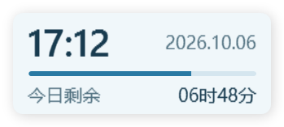

# 京时 · JingTime

京时（JingTime）是一个小巧、独立的 Windows 桌面悬浮钟，固定显示北京时间（UTC+8），同时呈现今日剩余时间和已过进度，无需修改系统时区。



## 功能

- 158×62 逻辑像素的紧凑界面，自动适配 Windows 缩放。
- 显示完整日期、当前时分和距北京时间今日结束的剩余时分。
- 中间进度条表示今天已过去的比例，每秒自动重新计算，从空逐渐变满。
- 始终置顶、可拖动、自动保存位置，不占任务栏。
- 右键或系统托盘可回到右上角、退出；重复启动只显示已有小钟。

## 构建与运行

环境：Windows 10/11、.NET 8 SDK。程序使用 WPF 和系统自带组件，无第三方 NuGet 依赖。

在仓库根目录运行 PowerShell：

```powershell
./Build.ps1 -Verify
./Release/BeijingClock.exe
```

`-Verify` 会执行核心测试，构建结果位于 `Release/`。也可以双击其中的 `BeijingClock.exe`。仅运行编译好的程序时，需要 .NET 8 Windows Desktop Runtime。

如果 SDK 不在 PATH 中，可指定路径；也可选择其他输出目录：

```powershell
./Build.ps1 -Verify -DotnetPath 'C:\path\to\dotnet.exe' -OutputDirectory 'artifacts/publish'
```

更新正在使用的程序前，先通过小钟右键菜单退出，再覆盖发布文件。

## 使用

首次打开位于屏幕右上方，按住小钟可拖动。位置保存在程序旁的 `clock-position.json`，因此请把程序放在可写入的文件夹中。原显示器不可用时，小钟会回到可见屏幕范围。

如果需要登录 Windows 后自动打开，可为 `BeijingClock.exe` 创建快捷方式，并把快捷方式放入当前用户的启动文件夹：按 `Win+R`，输入 `shell:startup` 后打开该文件夹。保持程序路径不变即可；取消自启时移除该快捷方式。

程序不会自动更改系统时区、任务栏时钟，也不创建服务或计划任务。

## 时间与进度规则

程序读取电脑提供的 UTC 时刻，固定换算成 UTC+8，与 Windows 选择的本地时区无关。程序不访问网络；如果电脑本身计时不准，小钟也会有相同误差。

“今天”以北京时间为准，倒计时到下一个北京时间零点。未满一分钟按一分钟显示：例如 23:59:59 显示 `00时01分`，零点切换日期并显示 `24时00分`。

进度条在北京时间零点清空，06:00 为 25%，12:00 为 50%，18:00 为 75%，午夜前接近填满。README 中的图片是固定设计示例。

## 验证与目录

```powershell
./Release/BeijingClock.exe --verify-ui ./artifacts/ui
```

界面验证模式检查固定样例、中午、午夜前、跨年零点及当前时刻的布局和进度长度，输出预览图与 `ui-report.json` 后退出。该模式不创建托盘图标，也不读取或保存日常位置。

- `App/`：WPF 窗口、托盘、拖动和屏幕定位。
- `Core/`：北京时间换算、剩余时间和位置存储。
- `Tests/`：不依赖第三方测试框架的核心验证。
- `Build.ps1`：构建、可选测试与发布。

代码独立编写，GitHub 时钟项目仅用于需求和交互参考，未复制其源码。
